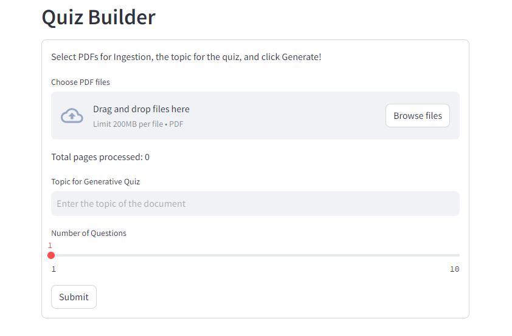
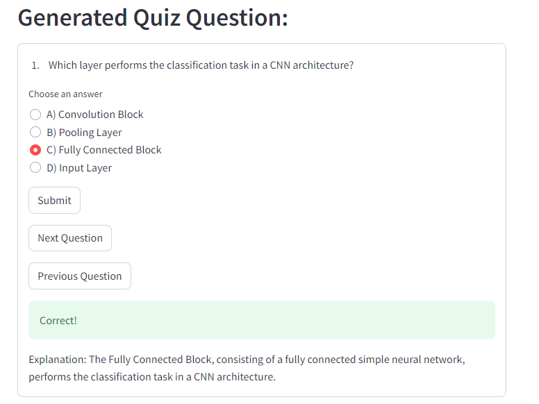

# Quiz Creator

## Setup Instructions

### Step 1: Google Cloud Project Setup
To use this application, you need to create a project in Google Cloud and download the `.json` key for authentication.

1. **Create a Google Cloud Project**:
   - Visit the [Google Cloud Console](https://console.cloud.google.com/).
   - Create a new project or select an existing one.

2. **Create and Download Service Account Key**:
   - Navigate to "IAM & Admin" > "Service Accounts".
   - Create a new service account.
   - Assign the necessary roles (e.g., Project Owner or Editor).
   - Create a key for this account in JSON format and download it.

### Step 2: Configure Your Application

1. **Set Up Configuration in `quiz.py`**:
   - Open the `quiz.py` file.
   - Replace the placeholder in `embed_config` with your actual Google Cloud Project ID.

   ```python
   if __name__ == "__main__":
       embed_config = {
           "model_name": "textembedding-gecko@003",
           # use your project id
           "project": "Your Project ID",
           "location": "us-central1"
       }

## Run the Application

Execute the following command in the terminal:

```bash
streamlit run .\quiz.py
```

## Interface


Chose file(s) to upload, type topic of your quiz, chose number of questions. Click sumbit.

Generator will create questions of you topic based of pdf(s) you provided


